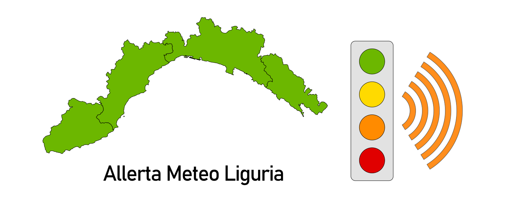

# Allerta Meteo Liguria (Estensione per Chrome)



Altre lingue disponibili: [en](README.md)

Semplice estensione per browser basati su Chromium che si interfaccia con il sito della Protezione Civile della Liguria e notifica in tempo reale eventuali aggiornamenti di stato rerlativi alle allerte meteo.

## Funzionalità

* Icona popup con colore dell'allerta meteo e tooltip con data ultimo aggiornamento e severità allerta meteo;
* Popup con cartina della Liguria nelle colorazioni delle allerte, e collegamenti a:
  * siti della Protezione Civile e di ARPA Liguria;
  * bollettini allerte e previsioni;
* Notifica desktop con severità dell'allerta meteo, ulteriori informazioni sui possibili rischi, e collegamenti ai siti della Protezione Civile e di ARPA Liguria.
* Opzioni per la personalizzazione (o eventuale correzione) dei collegamenti ai siti di Protezione Civile e ARPA Liguria, e dell'intervallo di tempo per il controllo degli aggiornamenti.

## Permessi

L'estensione necessita dei seguenti permessi per poter funzionare correttamente:

* `notifications`: per poter mostrare le notifiche desktop;
* `offscreen`: necessario per poter caricare in background la pagina della Protezione Civile dalla quale recuperare le informazioni necessarie (motivo per cui è necessario Chrome version 109 o superiore);
* `storage`: per registrare le opzioni dell'estensione.

## Installazione

Il codice dell'estensione è normale JavaScript (ES6), ma l'ambiente di sviluppo richiede che sia presente [Deno](https://deno.land/) nel sistema. I task di build fanno anche uso di [Skia](https://skia.org/) e [Puppeteer](https://pptr.dev/), che verranno installati alla prima esecuzione della build.

### Clona il repository
```bash
> git clone https://github.com/Ragnarokkr/allerta-meteo-liguria.git
```

### Installa [Deno](https://deno.land/) in base al tuo sistema operativo

Nella documentazione sul sito ufficiale puoi trovare tutte le informazioni necessarie ad [installare](https://deno.land/manual/getting_started/installation) Deno per il tuo sistema operativo.

### Task a disposizione

```bash
> deno task
  Available tasks:
  - build:clean
  - build:bump
  - build:debug
  - build:release
  - test:chrome
  - test:chrome:dry-run
  - test:chrome:debug
  - test:chrome:release
  - publish:package
  - tools:collector
```

* `build:clean`: rimuove le directory della cache temporanea e delle build;
* `build:bump`: incrementa la versione (maggiore, minore, o patch) nel manifest e nel changelog;
* `build:debug`: crea la build di debug dell'estensione;
* `build:release`: crea la build di release dell'estensione, priva di commenti e sezioni di log;
* `test:chrome`: esegue un'istanza di **chrome** con profilo utente temporaneo nella cartella di cache, con tutte le estensioni disabilitate, tranne la build di debug;
* `test:chrome:dry-run`: inizializza cartella di cache e profilo utente temporaneo senza avviare istanza di **chrome**;
* `test:chrome:debug`: crea la build di debug e avvia l'istanza di **chrome** usandola come estensione;
* `test:chrome:release`: crea la build di release e avvia l'istanza di **chrome** usandola come estensione;
* `publish:package`: crea la build di release, crea la grafica da caricare nel web store, e crea il file .zip
* `tools:collector`: avvia lo strumento di webscraping che colleziona i messaggi delle allerte dal sito web (usato per collezionare le stringhe che verranno usato in futuro per la localizzazione delle allerte).

Per i task `build:*`, è possibile dichiarare le variabili ambiente `PRODUCTION=debug` (default) o `PRODUCTION=release`, e `FLAGS=[clean,icons,covers,copy,manifest,locales,license,changelog,verbose]` per passare parametri alla build. I flag possono essere specificati con l'intestazione `--no-` in modo da essere disabilitati (fare riferimento a [build.ts](build/build.ts) maggiori informazioni relative ai flag di default).

Per il task `build:bump` è possibile specificare la parte di versione da incrementare con la variabile ambiente `RELEASE=[major|minor|patch]` (di default verrà incrementata la versione patch).

Per i task `test:chrome:*`, è possibile dichiarare le variabili ambiente `PRODUCTION=debug` (default) o `PRODUCTION=release`, e `FLAGS=[dry-run]` per specificare quale target e azione eseguire.

Per i task `tools:*`, è possibile dichiarare la variabile ambiente `FLAGS` per specificare eventuali opzioni (fare riferimento al codice del tool specifico per maggiori informazioni).

## Struttura del progetto

```text
.
├── .cache
│  └── chrome-test-dir
├── build
├── dist
│  ├── debug
│  ├── release
│  ├── allerta-meteo-liguria-marquee.png
│  ├── allerta-meteo-liguria-small.png
│  └── allerta-meteo-liguria.zip
├── extension
│  ├── resources
│  │  ├── cover.svg
│  │  ├── icon.svg
│  │  └── locales.yaml
│  ├── src
│  └── manifest.yaml
├── tools
├── .editorconfig
├── .gitignore
├── .prettierrc
├── deno.json
├── deno.lock
├── LICENSE
├── README.it.md
├── README.md
└── tsconfig.json
```

* `.cache`: directory temporanea per la creazione delle build;
  * `chrome-test-dir`: directory del profilo temporaneo per l'istanza di **chrome**;
* `build`: directory degli script per i task di creazione delle build;
* `dist`: directory per le build di debug e release;
  * `debug`: directory per la build di debug dell'estensione;
  * `release`: directory per la build di release dell'estensione;
  * `*.png`: i file .png vengono generati durante il processo di build dal file `cover.svg`;
  * `*.zip`: il file .zip viene creato nella fase di build della versione di release;
* `extension`: in questa directory sono presenti tutti i file necessari al processo di build;
  * `resources`: directory delle risorse condivise dalle build;
    * `cover.svg`: file vettoriale della copertina da caricare nel web store
    * `icon.svg`: file vettoriale dell'icona usata per l'estensione nell'web store e nel browser;
    * `locales.yaml`: file [yaml](https://yaml.org/) delle localizzazioni, usato per creare i file nelle varie lingue supportate
  * `src`: directory per i sorgenti dell'estensione
  * `manifest.yaml`: file [yaml](https://yaml.org/) con le impostazioni da usare per creare i file `manifest.json` necessario all'estensione;
* `tools`: tutti gli strumenti usati per lo sviluppo dell'estensione sono raggruppati qui
* `.editorconfig`: file di configurazione [EditorConfig](https://editorconfig.org/)
* `.gitignore`: file di git per l'esclusione di file/directory
* `.prettierrc`: file di configurazione di [Prettier](https://prettier.io/) 
* `deno.json`: file di configurazione per **Deno** e per i task
* `tsconfig.json`: file di configurazione per TypeScript.

## Configurazione

È possibile configurare la maggior parte delle impostazioni delle build tramite il file [`config_build.ts`](build/config_build.ts) presente nella directory `build`.

Nel file è possibile configurare le varie directory, le dimensioni e i colori delle icone, e quali file ignorare durante la build di release.

La classe istanziata, ritorna un oggetto con questa struttura:

```typescript
{
  manifest: { [key:string]: unknown },
  changelog: { [key:string]: unknown },
  extensionDir: string,
  resourcesDir: string,
  sourceDir: string,
  buildDir: string,
  iconsDir: string,
  popupIconSizes: number[],
  iconSizes: number[],
  promoSizes: { 
    [key:string]: {
      width:number, 
      height:number
    } 
  },
  popupIconColors: { [key:string]: string },
  excludedFiles: string[],

  getDistFiles(options?: DistFilesOptions): string[]
}
```

## Note tecniche e limitazioni conosciute

* Data la natura della procedura di acquisizione dei dati (*scraping*) dal sito web della Protezione Civile, è necessario tenere a mente che ogni futura modifica al codice HTML della pagina stessa può invalidare le informazioni ottenute, rendendo necessario aggiornare il codice dell'estensione.
* Dato che l'acquisizione dei dati avviene direttamente dalla pagina web, non è al momento possibile fornire versioni in lingue differenti dei messaggi di allerta ottenuti dal sito.
